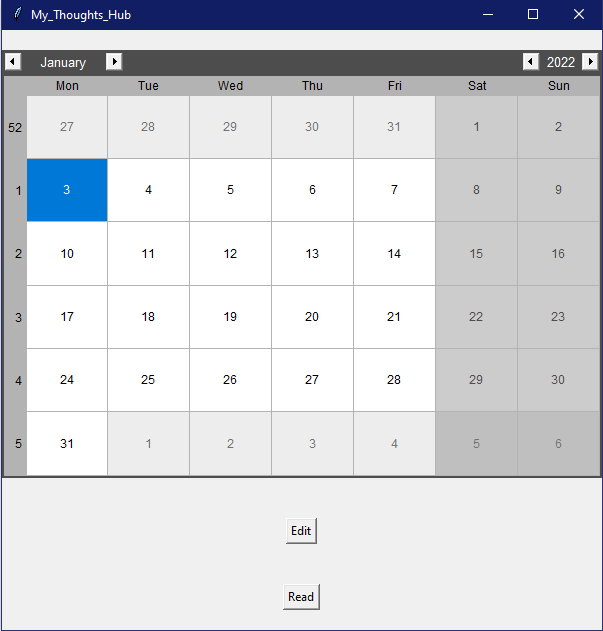
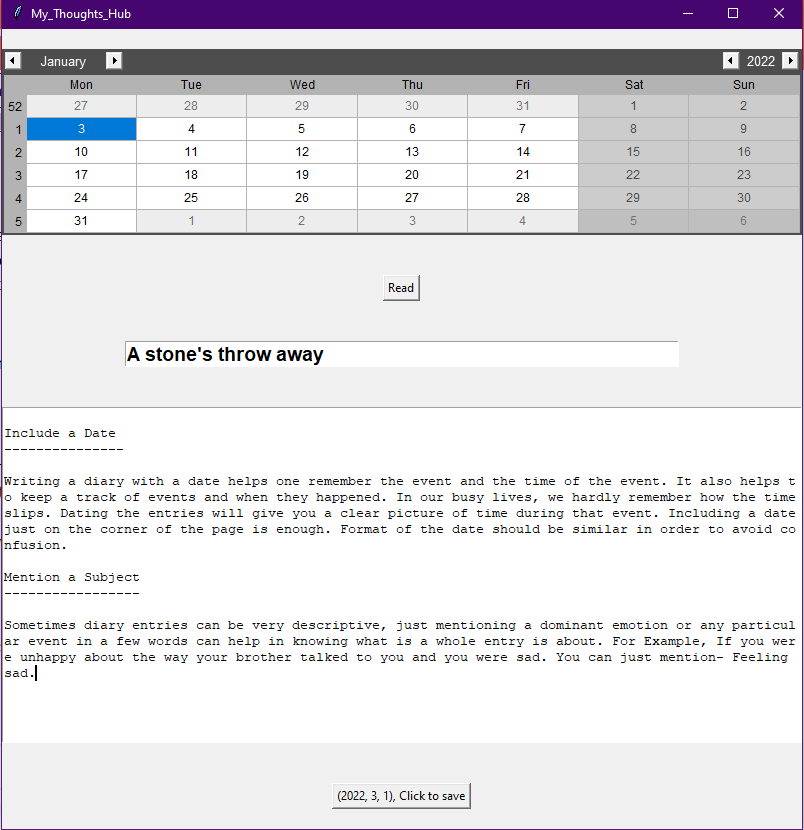
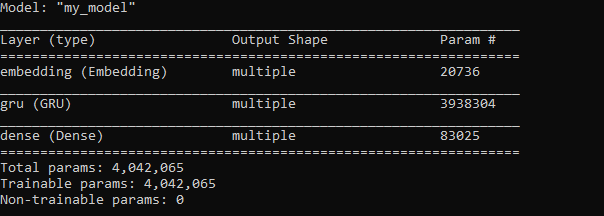

<<<<<<< HEAD
# Diary GUI using Tkinter 
This application is built with Python Tkinter

## Description 

The Diary GUI application is written in Python. \
It is an application to store written files with a date reference. \
The Diary App is built using the Tkinter library. \
The application has also been made an executable file that can be installed on a Windows operating system.

### The calendar

The main page of the user interface is a calendar initiated at the current date and month.

Additionally, there are 2 buttons:

- #### Edit: To open a page that offers 2 text fields. The top field is for the title the text being "bolded" and "big-fonted"
the bottom one is larger and that's where the body of the writing goes. None of the 2 texts are mandatory and all the text dispositions made in those fields
are respected in the .txt files where the text is later on saved along with the date.

- #### Read: To read (a) created file(s) on that date if available on the selected date.

# Natural language generation with RNN

The collected text through that calendar becomes train data to a Recurrent Neural Network to perform a text generation using TensorFlow and NumPy.

## Description

### First run through training data
This step is meant to collect all the characters in text. In fact, the model is character based.
Every character encountered in the training is saved in the vocabulary that will later be used to generate a text.

### Data processing
The text is vectorized using the  tf.keras.layers.StringLookup. 
Each character in the previously created vocabulary is changed to a numerical representation which are then replaced into the text split using tf.strings.unicode_split.

### Reverse data processing

 The tf.keras.layers.StringLookup(..., invert=True) helps invert the above data processing. It will be used to transform the generated tokens from the vector representation to readable characters.
We then apply tf.strings.reduce_join to join the characters back into strings which is a reverse method of the previous tf.strings.unicode_split.

## Training

 
=======
# Calendar Diary GUI using Tkinter 

A calendar desktop-app-like GUI using Python Python-Tkinter.

# Natural language generation with RNN

The saved text is used as training data on an NLG Recurrent Neural Network

>>>>>>> 564d7b4b7037ada6ae12307e558ded21a7101956
